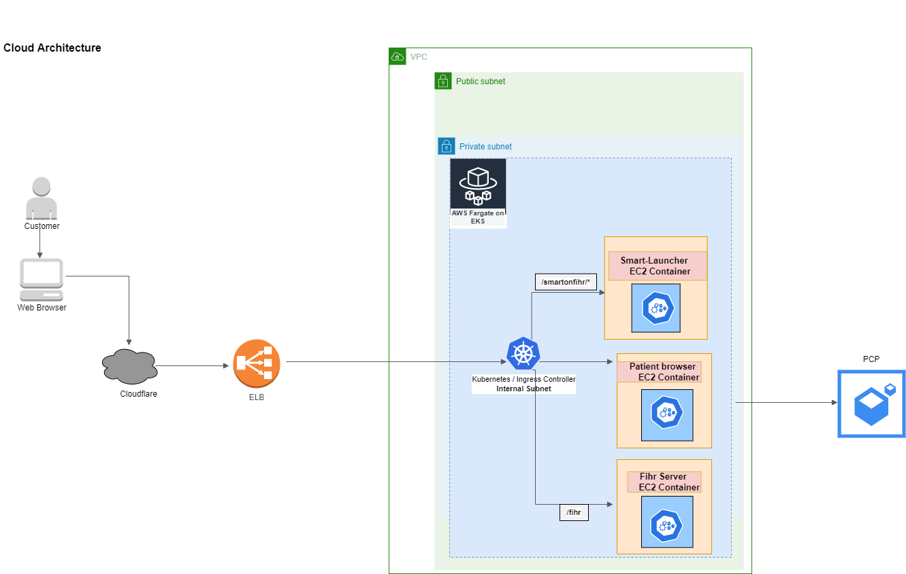

## Context

In current PCP testing, we use third party EHR. But due to downtime sometimes it is effecting the testing schedules.

Hence, an in house EHR with a patient browser would be very useful and can also provide a base for standalone app that is going to be developed.

## Decision

Establish an AWS account with EKS set up to deploy smart launcher, FIHR server and patient browser images.

The updated platform AWS account structure is illustrated below:

## Consequences

* External smart heath ehr simulator is no longer necessary

## Benefits

* Complete control and flexibility with inhouse simulator
* No down time for testers that we currently face
* We can leverage the same for standalone app where necessary
